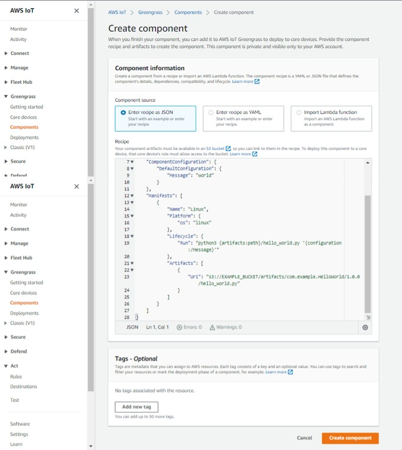

# Introduction
To give you some hands-on experience with the AWS ecosystem and
demonstrate what your VeeaHubs are capable of accomplishing, we have
created a Hello World custom component. It will be uploaded to your S3
bucket and deployed to AWS Greengrass core devices. To start working
with our Hello World component, follow the instructions given below.

# Uploading the Hello World Component to S3

To upload the component to S3, follow the below steps—

1.  Create an S3 bucket using the instructions laid out
    [here](https://docs.aws.amazon.com/AmazonS3/latest/userguide/create-bucket-overview.html).

2.  Once you have successfully created your bucket, go inside the bucket and click on **Create Folder**. You will land on the following page.

    

3.  Name this new folder as **artifacts** and then click on **Create
    Folder**. A folder named **artifacts** will be created inside your bucket.

    

4.  Now, we need to upload the **Hello World component code** to the
    artifacts folder. To get the code, please clone the contents of **this** repository.

     

5.  Once you have successfully cloned the repository, go to
    **veea-aws-greengrass/aws\_greengrass\_custom\_components/hello\_world/artifacts** on your host machine. At this location, you will find com.example.HelloWorld/1.0.0 folder. Upload the entire folder to your S3 bucket, inside the artifacts folder.

6.  After uploading the **com.example.HelloWorld/1.0.0** folder to your S3 bucket, the **artifacts** folder should have the **hello\_world.py** file.

# Deploying the Hello World Component to AWS IoT Greengrass

1.  Once you have successfully uploaded the Hello World component code
    to S3, navigate to AWS IoT Core.

2.  In the left-hand side menu, find **Greengrass Components**.

    

3.  Click on **Create Component**.

    

4.  Select **Enter Recipe as JSON** tab and in the code box, add the
    following recipe. (In the following code, in the **artifacts**
    blocks(line 23 and 35), replace the URI with the URI of the
    hello\_world.py file. You will find the URI for this file at
    **<S3\_bucket\_name>/artifacts/com.example.HelloWorld** in your S3 account. )

    ```
    {
    "RecipeFormatVersion": "2020-01-25",
    "ComponentName": "com.example.HelloWorld",
    "ComponentVersion": "1.0.0",
    "ComponentDescription": "My first AWS IoT Greengrass component.",
    "ComponentPublisher": "Veea",
    "ComponentConfiguration": {
        "DefaultConfiguration": {
        "Message": "world"
        }
    },
    "Manifests": [
        {
        "Platform": {
            "os": "linux"
        },
        "Lifecycle": {
            "Run": "python3 -u {artifacts:path}/hello_world.py \"{configuration:/Message}\""
        },
        "Artifacts": [
            {
            "URI": "s3://<bucket-name>/artifacts/com.example.HelloWorld/1.0.0/hello_world.py"
            }
        ]
        },
        {
        "Platform": {
            "os": "windows"
        },
        "Lifecycle": {
            "Run": "py -3 -u {artifacts:path}/hello_world.py \"{configuration:/Message}\""
        },
        "Artifacts": [
            {
            "URI": "s3://<bucket-name>/artifacts/com.example.HelloWorld/1.0.0/hello_world.py"
            }
        ]
        }
    ]
    }
    ```

    (*In the above JSON, the* run *key in the* Lifecycle *block runs the component code.*)

5.  Click on **Create Component**. You will be redirected to the My
    Components page and your new component will be listed in the list.

6.  The next step is to [give permission to your core
    devices](https://max2inc.atlassian.net/wiki/spaces/PD/pages/94197809265/Creating%2Band%2BDeploying%2BComponents#Getting-Required-Permissions-for-Custom-Component)
    to add custom components. After that, we can [deploy the Hello World
    component](https://max2inc.atlassian.net/wiki/spaces/PD/pages/94197809265/Creating%2Band%2BDeploying%2BComponents#Deploying-Components-to-Core-Devices)
    to our core devices.

7.  Once that is deployed, you can validate its status under My
    components of your Greengrass core device.
