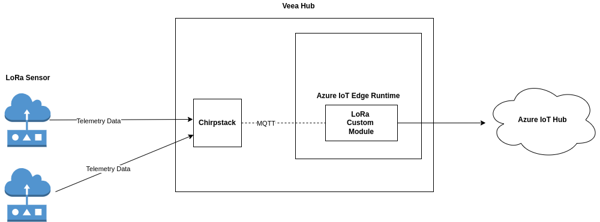
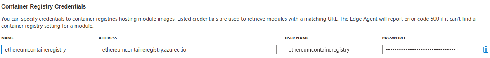
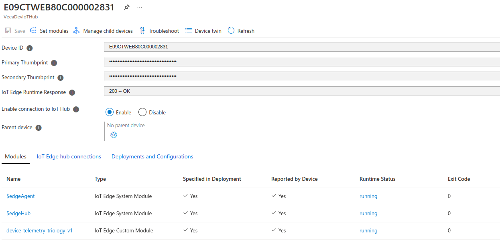

# Custom LoRaWAN Module Deployment
In this document, we will learn how we can deploy a custom LoRaWAN module to Azure IoT Edge Runtime. This module lets us push LoRaWAN sensor data from the Chripstack to Azure IoT Hub using the MQTT protocol.



As you can see in the above data flow diagram, this LoRaWAN module first discovers the Chirpstack MQTT URI and then subscribes to the LoRaWAN sensor device topic. Finally, it pushes the data to Azure IoT Hub.

## Pre-requisites

1. Before moving on, make sure that you are subscribed to the Veea LoRaWAN Chirpstack module and that your Chirstack application server has been properly set up. If not, please follow the instructions laid out
[here](https://developer.veea.com/VDG/Developing-an-Application-for-LoRaWAN.111345671.html).

2. Microsoft Azure Subscription is required. 

3. Azure CLI should be installed in development machine. Please follow the instructions laid out in the [documentation](https://docs.microsoft.com/en-us/cli/azure/install-azure-cli).

4. Visual Studio Code should be installed for monitoring the IoT hub data. It can be downloaded from the following [link](https://code.visualstudio.com/).


## Building and Pushing the Custom LoRaWAN Module to Azure Container Registry

To deploy this custom LoRaWAN module to Azure IoT Edge Runtime, follow the below steps—

1. Create an Azure Container Registry using the instructions laid out
    [here](https://docs.microsoft.com/en-us/azure/container-registry/container-registry-get-started-portal).

2. Git Clone the custom module code from the following [link](https://bitbucket.org/veea/veea-poc/src/VIG-1930/lora_azure_custom_module/).


3. Run the following commands to login to azure cli and the Azure
   container registry
   ``` 
   $az login 

   $az acr login --name <azure-container-registry-name>
   ```
   ```
   Example: az acr login -name ethereumcontaineregistry.azurecr.io
   ```
4. Navigate inside the custom module directory.
    ```
    cd veea-poc/lora_azure_custom_module/
    ```

5. Use **"docker build"** to build the image from Dockerfile, then tag the
   image appropriately and finally push the image to ACR using
   **"docker push"** as per this
   [document](https://docs.microsoft.com/en-in/azure/container-registry/container-registry-get-started-docker-cli?tabs=azure-cli#create-an-alias-of-the-image)

   1. Use the appropriate names for the image and tag for the following commands as per example given
    ```
    docker build -t <acr_repo_login_server>/<Image_name>:&lt;tag> .
    
    Example: docker build -t ethereumcontaineregistry.azurecr.io/device_telemetry_triology:v1 .
    ```
    ```
    docker push <acr_repo_login_server>/<image_name>:<tag>
    
    Example: docker push ethereumcontaineregistry.azurecr.io/device_telemetry_triology:v1
    ```


6. Now login to the Azure container registry and navigate to the
   appropriate repository and tag in the portal

7. Copy(Ctrl+c) the image name with tag from docker pull command.

    ```
    Example: ethereumcontaineregistry.azurecr.io/device_telemetry_triology:v1
    ```

8. The remaining steps can be followed from
   [here](https://developer.veea.com/documentation/VDG/Setting-up-Modules.1910079475.html#SettingupModules-AddingCustomModules) if the IoT hub is already created and provisioned. Else you can follow the next section to perform those steps.

## Deploying the LoRaWAN custom module to Azure IoT Hub as an IoT Edge Module


1.  Set up **IoT hub** using the following
    [documentation](https://developer.veea.com/VDG/Setting-up-IoT-Hub.1907490972.html)

2.  Provision **IoT Edge** using the following
    [documentation](https://developer.veea.com/VDG/Manual-Edge-Device-Provisioning-with-X.509-Certificates.2076279018.html)

3.  Add a **custom module** using the following
    [documentation](https://developer.veea.com/VDG/Setting-up-Modules.1910079475.html#SettingupModules-AddingCustomModules)

4.  Select **Set Modules** to update the configuration

    1. Enter the registry information that you noted down in the
        credentials step under the **Container Registry Credentials** so that it can authenticate with the Azure Container Registry.

         

5. Add a new “IoT Edge Module” from the “+ Add” drop down list.

6. Add a module named **device_telemetry_triology** and image URI which can be
    fetched from the repository of the *Azure container registry*.

7. Select **Review and Create** and complete the deployment by choosing
    **Create**.

8. Verify all the modules are running successfully:

   


## View the device telemetry in VS Code

1. Install the Azure IoT Tools extention on VS Code.
   Please follow this [link](https://marketplace.visualstudio.com/items?itemName=vsciot-vscode.azure-iot-tools)

2. Follow the following [link](https://devblogs.microsoft.com/visualstudio/azure-iot-tools-help-you-connect-to-azure-iot-hub-in-1-minute-in-visual-studio-code/) to view the device telemetry in VS Code.

